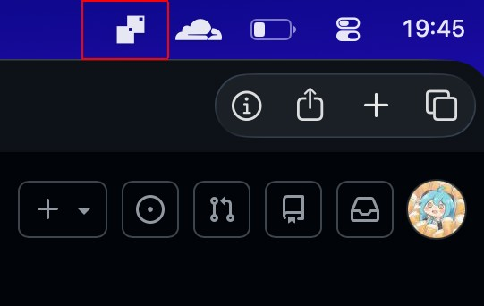
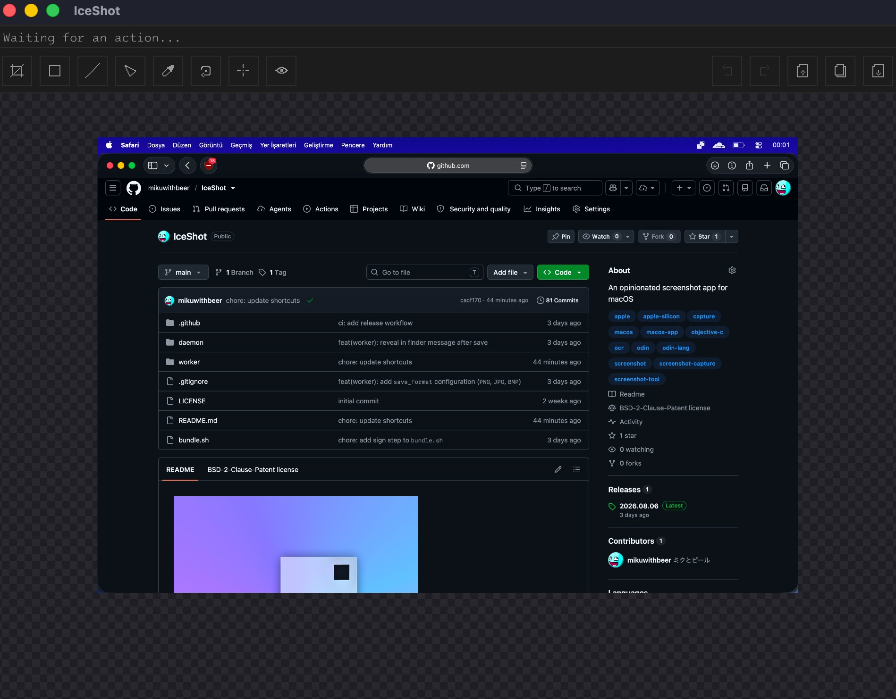

---

# IceShot

An opinionated screenshot app for macOS.

## Installation

Download the latest prebuilt binary from the [releases page](https://github.com/mikuwithbeer/IceShot/releases/latest).

Alternatively, build it from source.

## Screenshots

## Reason

There are already lots of screenshot applications, and many of them are great. I built **IceShot** because none of them matched the way I take screenshots.

I used **Shottr**[^1] for a long time and really liked it. I completely understand that software needs to make money, but I found the purchase popup a bit distracting. After seeing it enough times, I decided to build something that fit my own workflow.

Then I realised that almost every screenshot I took looked the same:

- Capture part of the screen.
- Crop it.
- Cover something with a rectangle.
- Save or copy the image.

I rarely used text, arrows, stickers, counters, or any of the other annotation tools.

**IceShot** is built around that simple workflow. If yours is similar, you'll probably enjoy using it.

## Configuration

**IceShot** runs as two small processes:

### Daemon

The daemon sits in your menu bar and listens for your shortcut. When you trigger, it starts the worker.

Its configuration is stored inside `~/.iceshot/daemon.json`.

### Worker

The worker is the screenshot application itself.

The first time you launch it, it creates a default configuration file inside `~/.iceshot/worker.json`. Even if there is few, settings can be changed by editing this file.

#### Saving Image

**IceShot** can save screenshots as:

- PNG
- JPG / JPEG
- BMP

Screenshots are saved to the output directory configured inside `worker.json`, you must create that directory if it does not exist.

## Shortcuts

### Daemon

> The daemon listens globally, so these shortcuts work from anywhere.

| Shortcut                       | Action         |
| ------------------------------ | -------------- |
| `Command` + `Left Shift` + `3` | Capture Screen |

### Worker

#### General

| Shortcut                       | Action      |
| ------------------------------ | ----------- |
| `Command` + `Z`                | Undo        |
| `Command` + `Left Shift` + `Z` | Redo        |
| `Command` + `Left Shift` + `S` | Share Image |
| `Command` + `C`                | Copy Image  |
| `Command` + `S`                | Save Image  |

#### Tools

Press the key again to enable or disable a tool.

| Shortcut | Tool                 |
| -------- | -------------------- |
| `C`      | Crop                 |
| `R`      | Rectangle            |
| `L`      | Line                 |
| `T`      | Triangle             |
| `I`      | Color Picker         |
| `M`      | Measurement          |
| `O`      | Rotate 90° Clockwise |
| `V`      | Use Vision (OCR)     |

#### Navigation

| Shortcut      | Action |
| ------------- | ------ |
| Mouse Wheel   | Zoom   |
| WASD / Arrows | Pan    |

## Appendix

This project is licensed under the **BSD-2-Clause Plus Patent License**.

[^1]: <https://shottr.cc>

[^2]: <https://imgur.com>

[^3]: <https://getsharex.com>
